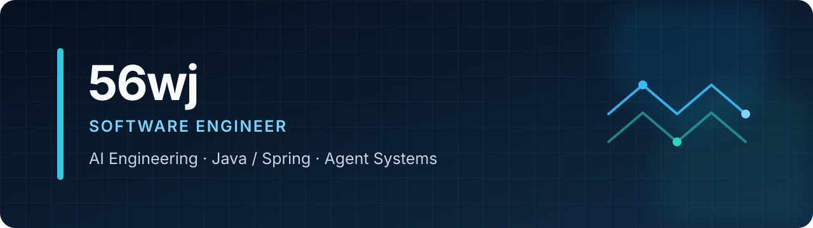

<p align="center">
  
</p>

<p align="center">
  <strong>Building production-minded AI systems, Java services, and optimization platforms.</strong>
</p>

<p align="center">
  <a href="https://github.com/56wj?tab=repositories">Projects</a>
  ·
  <a href="https://github.com/56wj?tab=overview&from=2026-01-01&to=2026-12-31">Activity</a>
  ·
  <a href="https://github.com/pulls?q=is%3Apr+author%3A56wj">Open Source</a>
</p>

## About

I'm a software engineer focused on turning complex operational problems into reliable, maintainable products.

- Building **AI Agent, RAG, and AIOps** applications with Java and Spring.
- Designing full-stack optimization systems with **Java, Python, Vue, and Docker**.
- Exploring **MCP, A2A, agent memory, and production AI infrastructure**.
- Contributing fixes and features to the open-source Java/AI ecosystem.

## Selected Projects

| Project | What it does | Stack |
| --- | --- | --- |
| [**Roll Load AI Platform**](https://github.com/56wj/Monorepo) | Enterprise-oriented roll-packing platform with durable compute orchestration, deterministic validation, and a planning-agent foundation. | Java · Python · Vue · Docker |
| [**Packing**](https://github.com/56wj/Packing) | Full-stack intelligent packing system with asynchronous calculation, Excel workflows, WebSocket updates, and 3D result visualization. | Spring Boot · Flask · Vue · Three.js · MySQL |
| [**Multi-Agent AIOps Platform**](https://github.com/56wj/mutil-rag-agent-main) | Skill-first intelligent operations platform with fast/deep RCA, hybrid RAG, MCP evidence collection, and a real-time control-room UI. | Python · FastAPI · LangGraph · Milvus · Kafka |
| [**Loss Follow Copier**](https://github.com/56wj/loss-follow-copier) | MT5 automation toolkit with local/remote position synchronization, stale-data protection, symbol mapping, and configurable risk controls. | MQL5 · Python · C++ |

## Open-Source Work

- [Spring AI — cache tool results in `BedrockProxyChatModel`](https://github.com/spring-projects/spring-ai/pull/6942)
- [Apache Fesod — support `Instant` string conversion](https://github.com/apache/fesod/pull/1089)
- [MCP Annotations — improve null synchronous-tool exception messages](https://github.com/spring-ai-community/mcp-annotations/pull/114)

## Toolbox

<p>
  
  
  
  
  
  
</p>

```text
Current focus: reliable agent workflows · evaluation · orchestration · applied optimization
```

